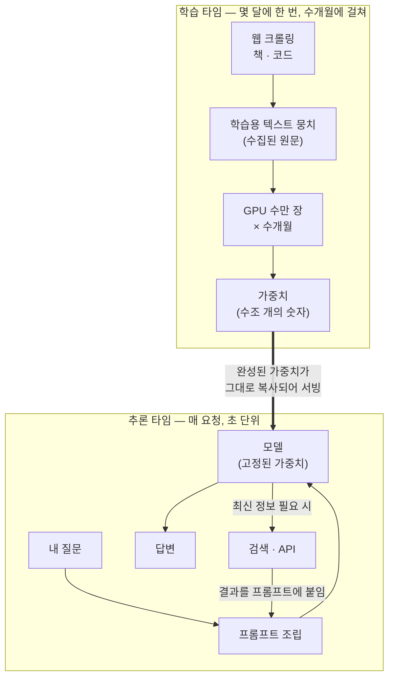

## 들어가며

어느 순간, 내가 AI에게 뭔가를 물을 때마다 시간을 붙여 말하고 있다는 걸 알아챘다.

"뉴스 업데이트해줘"가 아니라 "7월 20일 21시 34분 기준으로 속보 취합해줘"라고.

누가 알려준 적도 없고, 어디서 배운 것도 아니다. 그냥 그렇게 물으면 결과가 좋았고, 어느새 관성처럼 굳은 습관이었다.

그런데 문득 궁금해졌다. '나는 왜 이렇게 하고 있지? 이게 왜 먹히는 거지?'

그래서 원인을 파봤고, 알게 된 것이 재밌어서 남겨둔다.

## AI의 세계는 마지막 학습일에 멈춰 있다

원인은 단순했다.

AI의 학습 데이터는 실시간으로 동기화되는 게 아니라, 짧게는 몇 달에서 길게는 1년 단위의 스냅샷이다.

실제로 지금 내가 매일 쓰는 모델도 지식은 2026년 1월에서 멈춰 있다. 반년 전이다.

오늘 날짜 자체는 시스템이 넣어줘서 알고 있지만, 그 날짜와 자기 지식 사이의 반년 동안 세상에서 무슨 일이 있었는지는 모른다.

사람으로 치면, 반년을 자고 일어나서 달력만 확인하고 뉴스는 안 본 상태로 대화를 시작하는 셈이다.

## 두 개의 분리된 시간

구조를 그림으로 이해하고 나니 명확해졌다.

AI에는 완전히 분리된 두 개의 시간이 흐른다.

두 시간의 성격을 비교하면 이렇다.

|  | 학습 타임 | 추론 타임 |
|---|---|---|
| 주기 | 몇 달 ~ 1년에 한 번 | 내가 질문할 때마다 |
| 걸리는 시간 | 수개월 | 몇 초 |
| 하는 일 | 세상의 텍스트를 가중치로 압축 | 고정된 가중치로 답을 생성 |
| 세상과의 동기화 | 모델 업데이트 시점에 한 번 | 없음 — 검색이라는 우회로뿐 |

학습 타임은 몇 달에 한 번, 수개월에 걸쳐 돌아가고, 그 결과물인 가중치는 다음 학습 때까지 고정된다.

추론 타임은 내가 질문할 때마다 초 단위로 돌아가는데, 이때 모델은 그 고정된 가중치 위에서만 생각한다.

그래서 최신 정보는 모델의 기억에서 나오는 게 아니라, 검색이나 API라는 우회로를 통해 그때그때 손에 쥐여줘야 나온다.

## 내 습관은 정확한 대응이었다

여기까지 이해하고 나니, 무의식적으로 하던 행동의 원인이 설명됐다.

시점을 박아버리면, 모델이 자기의 멈춘 기억으로는 이 요청에 답할 수 없다는 걸 명확히 인지하고 검색이라는 우회로를 열러 간다.

시간을 명시하지 않으면 모델은 '내 기억으로 답해도 되겠지'라고 판단해버릴 여지가 생긴다.

그러니까 "지금 기준으로"보다 "**7월 20일 21시 34분 기준으로**"가 잘 동작했던 것은 우연이 아니었다.

나는 답을 먼저 몸으로 찾았고, 이유를 반년 늦게 배운 셈이다.

모델이 거듭 발전하면서 이런 판단 자체는 점점 나아지고 있다고 한다.

하지만 학습과 추론이 분리된 구조 자체는 그대로라서, 당분간 이 습관은 유효할 것 같다.

## 마치며

정리하고 보니, 이번에 배운 건 AI 지식이라기보다 습관을 의심해본 경험인 것 같다.

잘 돌아가는 루틴일수록 원인을 물을 이유가 없어서, 그냥 굴러간다.

그런데 '왜?'를 붙이는 순간 그 아래의 구조가 보였고, 구조를 알고 나니 습관이 더 정확해졌다.

**다음에도 관성처럼 하고 있는 행동을 발견하면, 한 번씩 파봐야겠다.**

그 아래에 뭐가 있는지는, 파보기 전에는 모르는 것 같다.
