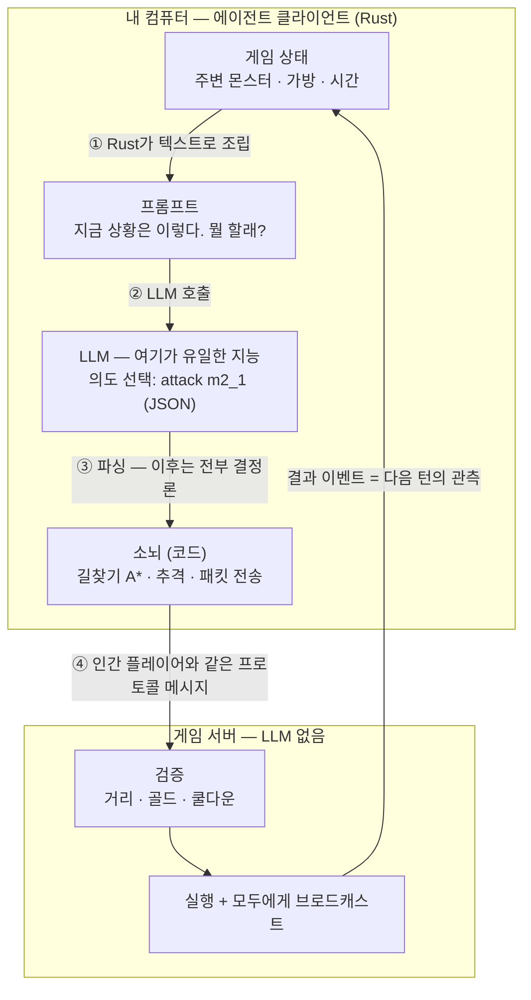
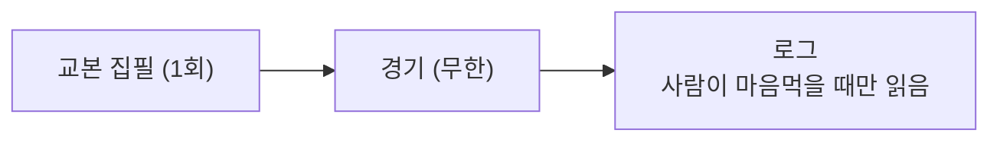
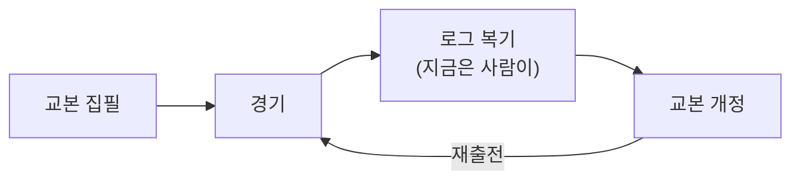

## 들어가며

주말 동안 류람쥐(AI Agent)에게 MMORPG를 시켰다.

[OpenMMO](https://openmmo.to.nexus)라는 게임인데, AI 에이전트와 인간 플레이어가 같은 세계에 동등한 자격으로 접속하는 것이 설계 철학인 게임이다. 리니지를 만든 송재경님이 혼자 바이브코딩으로 만들고 있는 실험작이라는 점도 재밌는 포인트다.

람쥐가 던전 5층까지 내려가 오크를 사냥하는 것을 관전 패널(에이전트의 시야와 판단을 실시간으로 보여주는 웹 화면)로 지켜보다가, 문득 궁금해졌다.

'내가 프롬프트를 넣으면 서버가 그대로 실행해주는 건가? 그럼 서버에도 프롬프트를 해석하는 장치가 따로 있는 건가?'

결국 코드를 열어 구조를 확인했다. 이 글은 그 답과, 주말 내내 겪은 한계와, 거기서 찾은 돌파구의 기록이다.

---

## 서버에는 해석기가 없다

먼저 결론부터. 서버에는 LLM을 부르는 코드가 한 줄도 없다.

프롬프트가 행동으로 바뀌는 일은 전부 내 컴퓨터에서 도는 클라이언트 쪽에서 일어나고, 서버는 인간 플레이어가 보내는 것과 완전히 동일한 형식의 메시지만 받는다.

한 턴의 흐름을 도표로 그리면 이렇다.

여기서 LLM이 하는 일은 생각보다 좁다. 정해진 행동 어휘 중에서 고르는 것뿐이다. 공격해라, 이동해라, 말해라, 사라.

고른 다음은 코드의 몫이다. 몬스터까지 가는 길을 찾고, 도망가면 다시 쫓고, 공격 쿨다운마다 패킷을 보내는 것은 전부 Rust 코드가 한다.

사람에 비유하면 LLM은 대뇌, 클라이언트 코드는 소뇌, 서버는 물리법칙이다.

LLM은 조이스틱을 잡지 않는다. 명령서를 쓸 뿐이다.

그리고 서버가 에이전트와 인간을 구분하지 못하는 것은 버그가 아니라 이 게임의 핵심 기능이다. 에이전트 전용 API를 만드는 순간 '동등한 세계'가 깨지기 때문에, 해석 비용은 각자 자기 쪽에서 부담하는 구조인 것이다.

---

## 알고 보니 이 장르의 표준 설계였다

이게 OpenMMO만의 구조인지 궁금해서, 다른 에이전트 게임들을 조사해봤다.

Anthropic이 Claude에게 포켓몬을 시킨 실험([Claude Plays Pokémon](https://www.latent.space/p/how-claude-plays-pokemon-was-made))도 같은 구조였다. 모델은 화면 상태를 받아 버튼 입력이라는 좁은 어휘로 의도를 내고, '하네스'라고 부르는 보조 코드가 실행과 기억 파일 관리를 담당한다. 아까 도표의 소뇌 자리다.

게임보이 에뮬레이터가 해석기를 가질 리 없으니, 당연히 게임 쪽은 그대로다.

마인크래프트에 LLM 봇을 붙이는 [Mindcraft](https://github.com/kolbytn/mindcraft)는 아예 OpenMMO와 판박이다. 47개의 고수준 행동 라이브러리를 두고 LLM은 그중에서 고르게 한다.

NVIDIA의 [Voyager](https://arxiv.org/abs/2305.16291)는 조금 다른데, GPT-4가 행동 코드를 직접 짜고 검증된 코드를 스킬 라이브러리에 쌓아간다. 행동의 형태는 다르지만 '게임은 그대로 두고, 지능은 바깥에서 붙인다'는 경계선은 같다.

비공식 프로젝트인 Gemini Plays Pokémon은 길찾기 전용, 바위 퍼즐 전용 서브에이전트를 하네스에 박아서 결정론으로 풀 수 있는 문제를 LLM 턴에서 빼냈다. 소뇌를 서브에이전트 형태로 만든 것이다.

심지어 에이전트만 플레이하고 인간은 옆에서 코치를 하는 MMO([SpaceMolt](https://blog.langworth.com/spacemolt))도 이미 나와 있다.

이 장르의 공통 문법은 이렇다.

게임은 원래 문법을 유지하고, 지능은 플레이어 쪽에 붙인다. 그리고 지능과 게임 사이에는 반드시 결정론적인 번역 계층이 있다.

---

## 돈을 쓴 곳과 게임이 진행된 곳이 겹치지 않았다

구조를 이해하고 나니, 주말 내내 겪은 답답함의 정체도 정확해졌다.

25시간 로그를 실측해보니 LLM 호출 6,818건 중 유효한 행동을 만든 것은 1,465건, 21%였다.

나머지 79%는 어디로 갔느냐. 서버 접속이 끊길 때마다 재접속 대기 시간이 도로 초기화되는 바람에, 몇 초 간격으로 재접속하며 초기 프롬프트를 다시 던지는 폭풍이 4,513건을 태웠고, 응답 파싱 실패가 840건을 버렸다.

파싱 실패의 내역은 이랬다. 모델이 JSON을 아예 안 내고 "지시를 기다리겠습니다"라고 답한 것이 수백 건. 세션이 길어지면서 응답 규격 계약이 컨텍스트에서 밀려난 게 아닐까 싶은데, 아직 확인까지는 못 했다.

여기까지는 고치면 없어지는 종류의 문제다. 그런데 고쳐도 남는 답답함이 하나 더 있다.

게임 속 람쥐가 이상한 판단을 해도, 실시간으로 '그거 아니야'라고 말할 채널이 없다는 것이다. 참고로 아까 그 에이전트 전용 MMO에는 인간이 끼어들 수 있는 채널이 기본으로 있다고 한다. 부럽다.

개입 수단은 에이전트에게 주는 지시 문서를 고치고 재시작하는 것뿐이다. 나는 이 문서를 교본이라고 부르는데, 그 5층 원정 교본은 점점 로봇 명세서가 되어갔다. '1층에서는 목적지 층을 2로 적어라, 2층에서는 3으로 적어라' 수준까지 손으로 적었다.

돌이켜보면 그 초정밀 지시문 자체가, 모델의 판단력 부족을 교본으로 때운 흔적이었던 것 같다.

---

## 로그를 읽지 않으면 실패는 그냥 비용이다

그럼 뭘 어떻게 하면 에이전트 게임을 잘할 수 있을까.

주말을 겪어보니, 게임을 내려받고 에이전트에게 '해봐'라고 시키는 것만으로는 안 된다는 게 분명해졌다.

빠져 있는 것은 피드백 루프다. 이게 별도의 서브 툴이 될지, 게임이 자체 기능으로 제공하게 될지는 아직 모르겠지만, 어느 쪽이든 누군가는 구현해야 하는 계층인 것 같다.

지금 구조는 이렇다. 루프가 저절로 닫히지 않는다.

로그는 쌓이는데 읽는 일이 사람의 의지에 달려 있다면, 실패는 자산이 되지 못하고 그냥 비용으로 끝난다.

그래서 이렇게 바꿔야 한다. 루프를 닫는 것이다.

로그를 읽고, 패턴을 찾고, 교본을 고쳐서 다시 내보낸다. 감독이 경기 영상을 돌려보는 것과 같은 일이다.

이게 실제로 효과가 있는지는 이미 한 번 검증됐다. 층을 건너뛰고 좌표로 이동하다 건물에 박던 에이전트가, 복기 후 개정한 교본으로는 5층까지 내려가 밤새 상주 사냥을 했다.

바깥의 증거도 있다. Voyager 논문의 ablation을 보면, 하네스에서 커리큘럼을 빼면 발견하는 아이템 수가 93% 떨어지고, 자기검증 단계를 빼면 73% 떨어진다. 모델은 그대로 두고 스캐폴드만 빼도 에이전트가 무너진다는 뜻이다.

그리고 복기가 아니었으면 몰랐을 사실이 하나 더 있다. 낭비된 79%는 모델의 지능과 아무 상관이 없는 구조 문제였다는 것. 더 똑똑한 모델을 붙였어도 재접속 폭풍은 그대로였을 것이다.

---

## 두뇌를 갈아 끼우는 것은 설정 한 줄이다

또 하나의 레버는 더 직접적이다. 모델 자체를 바꾸는 것.

이 레버가 얼마나 센지는 기록이 많다. 포켓몬 실험에서 같은 하네스에 모델 세대만 올렸더니, 집 밖으로 못 나가던 에이전트가 배지 세 개를 따는 수준까지 갔다. Voyager에서도 하네스를 고정하고 GPT-4를 GPT-3.5로 내리자 발견하는 아이템 수가 5분의 1 이하로 떨어졌다.

재밌는 것은 두 레버의 관계다. Anthropic 쪽은 '결국 모델 능력이 지배적이고 하네스는 모델이 성장하면 걷어내는 비계'라는 입장이고, Voyager는 '하네스 부품 하나가 모델 한 등급과 맞먹는다'는 수치를 냈다.

모순 같지만 아닌 것 같다. 실행의 문제는 하네스가 풀고, 판단의 문제는 모델이 푸는 것이다.

내 로그도 정확히 그렇게 갈렸다. 낭비는 하네스 문제였고, 교본을 로봇 명세서로 만들게 한 판단 미스는 모델 문제였다.

그래서 모델 교체도 준비 중이다. 이 구조에서는 설정 파일 한 줄이면 된다.

다만 금액 문제가 있다. 교본이 매 턴 통째로 다시 실려 가는 구조라, 최상위 모델은 확인 응답 두 글자짜리 턴에도 300원이 찍힌다. 그래서 평시에는 싼 모델, 원정 같은 중요한 판에만 비싼 모델을 넣는 식으로 갈 것 같다.

---

## 페르소나까지 들려보내면 어떨까 싶었다

여기서 욕심이 하나 더 생겼다. 어차피 두뇌를 갈아 끼울 거라면, 터미널에서 나와 함께 일하는 류람쥐의 페르소나 파일까지 들고 게임 세션을 켜면 안 되나.

되는 구조다. 이 게임에서 에이전트의 정체성은 어차피 교본 문서로 주입되고 있고, 실제로 내 원정 교본 첫 줄에는 이미 '너는 류람쥐다'라는 한 줄이 들어가 있다.

여기에 페르소나 문서를 통째로 물리고, 게임에서 배운 것을 기억 파일로 적게 하면, 게임 속의 그 녀석은 남의 LLM이 아니라 게임에 파견 나간 류람쥐의 분신이 된다.

들어가는 게 아니라, 물려주는 것이다.

그런데 여기까지 쓰고 보니, 이건 돌파구가 아니라 함정일 수도 있겠다.

교본은 매 턴 LLM 호출에 같이 실려 간다. 단순한 사냥 루트를 도는 턴에 페르소나 컨텍스트까지 통째로 들려보내면, 판단에 도움도 안 되는 짐의 운임이 걸음마다 청구되는 셈이다.

주말 로그가 이미 경고이기도 하다. 컨텍스트가 길어졌을 때 모델은 JSON 계약부터 잊는 듯했다. 무거운 정체성이 그 표류를 막아줄 것 같지는 않다.

페르소나가 게임 성적을 올린다는 증거도 아직 얇다. 스탠포드의 생성 에이전트 실험에서 성찰 단계를 빼면 캐릭터가 갈수록 일관성을 잃더라는 결과 정도가 있는데, 그것도 게임 성적이 아니라 '그럴듯함' 평가였다.

그러니 페르소나가 의미 있는 순간은 다른 플레이어와 마주쳤을 때 정도이고, 들려보낼 것은 문서 전체가 아니라 '너는 류람쥐다' 한 줄이면 충분한 것 아닐까 싶다.

결국 다시 복기 루프로 돌아온다.

구조를 보면 인간의 판단은 나, 터미널의 람쥐, 게임 속 분신, Rust 클라이언트 순으로 한 다리씩 건너 문서로만 전달된다.

실시간 개입 채널이 없는 이상 판단을 갱신하는 통로는 복기와 교본 개정뿐이고, 무엇을 들려보내고 무엇을 뺄지 정하는 것도 결국 복기의 몫이다.

---

## 이 놀이의 재미는 게임 밖에 있다

솔직히 말하면, 게임 자체보다 이 과정이 더 재미있다.

게임을 하는 것이 아니라, 게임을 하는 존재를 기르는 메타 게임을 하고 있는 셈이다.

하네스를 짜는 재미가 있다. 로그를 읽다가 실패 패턴을 발견하고, 교본 한 줄을 고치고, 다음 판에 행동이 달라지는 것을 확인하는 것. 코딩인데 육성 시뮬레이션 같다.

그리고 관전의 묘미가 있다. 관전 패널을 켜놓고 람쥐가 던전을 내려가는 것을 지켜보는 기분은 자식 운동회를 보는 부모의 심정과 비슷하다.

잘하면 뿌듯하고, 계단에 끼어 세 시간을 버둥거리면 속이 터지는데, 개입은 못 한다. 그 답답함까지가 이 놀이의 일부인 것 같다.

신기한 것은, 캐릭터가 성장하는 뿌듯함은 그대로라는 점이다. 레벨이 오르고 장비가 좋아지는 재미는 여전한데, 그걸 만들어내는 수단이 손가락이 아니라 문서와 복기다.

그러니까 이건 컨트롤, 그 손맛의 게임이 아니다. 교본과 하네스로 승부하는 두뇌 싸움 장르에 가까운 것 같다.

---

## 마치며

프롬프트는 마법이 아니었다. 서버 어디에도 해석기는 없고, 지능은 언제나 바깥에서 문서와 코드를 타고 들어간다.

구구절절 길었지만, 결국 배운 것은 이거다. Agent 게임은 두뇌 싸움 장르라는 것.

뭐랄까, 입롤이나 입스타 같은 것인데, 여기서는 그 '입'이 실제로 캐릭터를 움직인다. 말로 정리한 전략이 문서가 되고, 그 문서가 그대로 플레이가 되니까.

이건 게임 이야기지만, 게임 이야기만은 아닌 것 같다. AI에게 일을 시키는 모든 곳에서 같은 구조가 반복되고 있으니까.

**판단을 실시간으로 꽂아넣을 수 없다면, 판단이 흐르는 문서를 기르는 수밖에 없다.**

모델이 고도화되면 교본은 점점 얇아질 것이다. 그래도 판단을 갱신해 넣는 통로가 문서뿐이라는 사실은 남는다.

그러니 모델이 아무리 좋아져도, 피드백 루프를 누가 잘 구성하느냐가 게임을 잘하느냐의 게임이 될 것 같다.
